  

  <a href="https://checkmyprofolio.github.io/"><b>🌐 Portfolio</b></a>
  &nbsp;·&nbsp;
  <a href="https://orcid.org/0009-0009-0658-6157"><b>🔬 ORCID</b></a>
  &nbsp;·&nbsp;
  <a href="https://github.com/viditshah5656"><b>💻 GitHub</b></a>

 

# Hi, I'm Vidit Shah 👋

I’m a **Robotics & Automation engineer who builds intelligent systems** — especially where robotics, AI, computer vision, software architecture, and local inference meet.

My strongest skill is not one framework or one model. It is **connecting the pieces into a working system**: sensing data, reasoning over it, choosing an action, integrating the software, and turning the result into something people can actually use.

> **My engineering loop:** `PERCEIVE → UNDERSTAND → PLAN → BUILD → TEST → SHIP`

---

## 🧭 What I’m strongest at

<table width="100%">
  <tr>
    <th align="left">Area</th>
    <th align="left">What I can build</th>
    <th align="left">Typical tools</th>
  </tr>
  <tr>
    <td><b>🤖 Robotics & Automation</b></td>
    <td>Closed-loop systems that connect sensors, logic, planning and physical action.</td>
    <td>Control systems · PLCs · Microcontrollers · Robotics · Automation</td>
  </tr>
  <tr>
    <td><b>🧠 AI / ML / LLMs</b></td>
    <td>Model-driven applications, local inference, agent workflows, prediction pipelines and intelligent automation.</td>
    <td>Python · PyTorch · TensorFlow · LLMs · RAG · Agents · LoRA / QLoRA</td>
  </tr>
  <tr>
    <td><b>👁️ Computer Vision</b></td>
    <td>Systems that turn images and video into useful machine-readable information.</td>
    <td>OpenCV · Vision pipelines · Detection · Image processing · ML inference</td>
  </tr>
  <tr>
    <td><b>⚙️ AI Infrastructure</b></td>
    <td>Local-first runtimes, model routing, API layers, streaming interfaces and hardware-aware inference systems.</td>
    <td>llama.cpp · GGUF · FastAPI · TypeScript · HTTP APIs · CUDA</td>
  </tr>
  <tr>
    <td><b>🌐 Software Architecture</b></td>
    <td>Full-stack applications where the frontend hides backend complexity and the pieces remain understandable.</td>
    <td>React · Next.js · Electron · Vite · FastAPI · SQLite · TypeScript</td>
  </tr>
  <tr>
    <td><b>🔌 APIs & Integration</b></td>
    <td>Compatible interfaces that connect multiple models, services and runtimes behind one developer-facing surface.</td>
    <td>REST · OpenAI-compatible APIs · Anthropic Messages · SSE · WebSockets</td>
  </tr>
  <tr>
    <td><b>🧪 Rapid Prototyping</b></td>
    <td>Taking an idea from experiment → benchmark → working prototype → polished product.</td>
    <td>Python · JavaScript / TypeScript · Git · Linux · Docker · Testing</td>
  </tr>
</table>

---

## 🔍 How I think about engineering

<table width="100%">
  <tr><td width="20%"><b>01 · Perceive</b></td><td>Collect signals from sensors, images, APIs, files or user input.</td></tr>
  <tr><td><b>02 · Understand</b></td><td>Use algorithms, ML models or LLMs to extract meaning from those signals.</td></tr>
  <tr><td><b>03 · Plan</b></td><td>Apply constraints, routing logic, tool selection and system rules.</td></tr>
  <tr><td><b>04 · Build</b></td><td>Implement the backend, interfaces, integrations and runtime required to execute the idea.</td></tr>
  <tr><td><b>05 · Test</b></td><td>Benchmark behavior, inspect failure modes, debug edge cases and improve reliability.</td></tr>
  <tr><td><b>06 · Ship</b></td><td>Package the system, document it and make it usable beyond my own machine.</td></tr>
</table>

---

## 🚀 What I actually build

### 🟣 Local AI & intelligent assistants

I work heavily with **local-first AI**: running models on-device, managing limited hardware resources, connecting models to tools, and building interfaces around the runtime rather than treating an LLM as a black box.

`Local GGUF inference` `RAG` `Context injection` `Agent/tool orchestration` `Streaming` `Voice pipelines` `Hardware-aware inference` `Multi-backend gateways`

### 🔵 Robotics, control & automation

My robotics background gives me the systems perspective behind the software: **sensors are inputs, intelligence is decision-making, and control is the mechanism that produces an action**.

`Automatic control` `Robotics` `Microcontrollers` `PLC` `Sensors` `Planning` `Automation` `Machine-vision workflows`

### 🟢 Computer vision

I approach computer vision as a **sensory layer for larger systems**:

`camera / image → preprocessing → detection / inference → decision → action`

### 🟠 Product-minded software engineering

I care about the layer people actually touch. I like building interfaces and developer tooling that make technically difficult systems feel clear and usable.

`Python ↔ APIs ↔ inference ↔ databases ↔ TypeScript ↔ React / Electron`

---

## 🧩 Selected projects

<table width="100%">
  <tr>
    <th align="left">Project</th>
    <th align="left">What it demonstrates</th>
    <th align="left">Stack</th>
    <th align="left">Status</th>
  </tr>
  <tr>
    <td><b>Infera</b></td>
    <td>Local-first AI gateway unifying model backends behind familiar API contracts and a browser workspace.</td>
    <td>Python · TypeScript · FastAPI · SSE · OpenAI-compatible APIs</td>
    <td>🚧 Building</td>
  </tr>
  <tr>
    <td><b>MeeraAI</b></td>
    <td>Local desktop AI assistant with model orchestration, RAG, voice, tools and hardware-aware inference.</td>
    <td>Python · FastAPI · Electron · llama.cpp · SQLite · React</td>
    <td>🧪 R&amp;D</td>
  </tr>
  <tr>
    <td><b>AarnaAI</b></td>
    <td>Market-analysis experiment combining recurrent models, tree-based prediction and technical indicators.</td>
    <td>Python · TensorFlow / Keras · scikit-learn · Streamlit · yfinance</td>
    <td>🧪 R&amp;D</td>
  </tr>
  <tr>
    <td><b>Autonomous AI Portfolio</b></td>
    <td>Interactive portfolio concept using local browser inference to make AI part of the interface itself.</td>
    <td>Next.js · React · TypeScript · Web-LLM · WebGPU</td>
    <td>✅ Live</td>
  </tr>
  <tr>
    <td><b>Binance Futures Testnet CLI</b></td>
    <td>CLI engineering focused on signed requests, validation, error boundaries and deterministic API behavior.</td>
    <td>Python · Click · pytest · HMAC-SHA256</td>
    <td>✅ Testnet</td>
  </tr>
</table>

---

## 🛠️ Technical toolkit

| Layer | Technologies |
|---|---|
| **Languages** | Python · C++ · TypeScript · JavaScript · SQL · HTML · CSS |
| **AI / ML** | PyTorch · TensorFlow · Keras · scikit-learn · LSTM · Random Forest · RAG · Agents · LoRA · QLoRA |
| **Local AI / Inference** | llama.cpp · GGUF · CUDA · Web-LLM · WebGPU · Model Routing · Streaming |
| **Robotics / Vision** | Robotics · Automatic Control · PLC · Microcontrollers · OpenCV · Machine Vision · Sensors · Automation |
| **Software** | FastAPI · React · Next.js · Electron · Vite · SQLite · REST · SSE · Docker · Linux · Git |

---

## 💡 Strengths beyond the toolchain

<table width="100%">
  <tr>
    <td width="33%" valign="top"><b>Systems thinking</b> Breaking complicated products into clear interacting components and interfaces.</td>
    <td width="33%" valign="top"><b>Hardware awareness</b> Thinking about VRAM, latency, compute limits, runtime cost and the machine underneath the software.</td>
    <td width="33%" valign="top"><b>End-to-end ownership</b> Moving between model logic, backend services, APIs, UI and deployment.</td>
  </tr>
  <tr>
    <td valign="top"><b>Debugging mindset</b> Tracing problems through the stack instead of patching only the visible symptom.</td>
    <td valign="top"><b>Experimentation</b> Exploring new models and architectures while comparing them against real constraints.</td>
    <td valign="top"><b>Product translation</b> Turning technically complex ideas into interfaces and workflows other people can understand.</td>
  </tr>
  <tr>
    <td valign="top"><b>Integration mindset</b> Connecting services, models, devices and APIs into one coherent workflow.</td>
    <td valign="top"><b>Performance awareness</b> Balancing model quality, memory, latency and reliability instead of optimizing only one metric.</td>
    <td valign="top"><b>Learning velocity</b> Comfortable picking up unfamiliar frameworks, runtimes and models to solve the actual problem.</td>
  </tr>
</table>

---

## 📈 What I want my work to communicate

<table width="100%">
  <tr><td><b>Build systems, not isolated demos.</b></td><td>Projects should show architecture, integration, reliability and a real user-facing outcome.</td></tr>
  <tr><td><b>Make AI practical.</b></td><td>Use models as parts of useful systems rather than building around the model alone.</td></tr>
  <tr><td><b>Keep the machine visible.</b></td><td>Understand compute, memory, latency and control instead of pretending infrastructure does not matter.</td></tr>
  <tr><td><b>Design for actual use.</b></td><td>A technically impressive backend should still be understandable to the person using it.</td></tr>
</table>

---

## 📚 Current engineering interests

`Local AI` · `AI Agents` · `LLM Infrastructure` · `RAG` · `Model Routing` · `Computer Vision` · `Robotics` · `Autonomous Systems` · `Human-AI Interfaces` · `Voice AI` · `Edge Inference` · `Hardware-Aware AI`

---

## 📊 GitHub telemetry

  
  

  

---

## ⚡ In one sentence

> **I build intelligent systems that connect perception, AI, software and automation — with a strong preference for local control, understandable architecture and practical engineering.**

<b>Robotics · AI · Vision · Local Inference · Systems Engineering</b>

