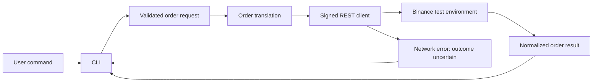

<p align="center"></p>

<p align="center">
  <a href="#start-here">Start here</a> ·
  <a href="#inside-the-system">Architecture</a> ·
  <a href="notebook/README.md">Engineering notebook</a> ·
  <a href="#public-engineering-index">Live repository index</a>
</p>

# Hey, I'm Vidit.

I build software that connects an idea to a working system. My public work currently centers on Python automation and API integration: explicit boundaries, validated inputs, and useful behavior when something goes wrong.

This profile is the front door to my engineering notebook. Follow a project into its source, inspect a decision, or reproduce its checks. The interesting part is how the system behaves under constraints.

## Start here

### 01 / Binance Futures Testnet CLI

**A Python command-line system for market, limit, and stop-limit orders in a test environment.**

The engineering challenge is turning a user's request into a signed API call while keeping invalid inputs, exchange rejections, and uncertain network outcomes distinguishable.

- **Boundaries:** command-line interaction, validation, order translation, and HTTP transport live in separate modules.
- **Protocol:** HMAC-SHA256 request signing with timestamps and a receive window.
- **Precision:** quantities and prices use decimal values before being serialized for the API.
- **Failure behavior:** an explicit exchange rejection produces a structured result; a network error propagates for the CLI to report an uncertain outcome.
- **Verification:** inspect the repository's mocked tests and run them locally; testnet execution is a separate integration check.

[Explore the repository →](https://github.com/rockstar5656/binance-futures-trading-bot) · [Read the tests →](https://github.com/rockstar5656/binance-futures-trading-bot/tree/main/tests) · [Inspect the transport →](https://github.com/rockstar5656/binance-futures-trading-bot/blob/main/bot/client.py)

## Inside the system



The transport layer owns signing and HTTP concerns. The order layer understands exchange parameters. The CLI presents the result. Those boundaries make it possible to verify behavior without requiring a live account for every test.

<details>
<summary><b>Review this project like an engineer</b></summary>

1. Read [`OrderRequest` and validation](https://github.com/rockstar5656/binance-futures-trading-bot/blob/main/bot/validators.py): which inputs can reach the network?
2. Inspect [`_order_params_from_request`](https://github.com/rockstar5656/binance-futures-trading-bot/blob/main/bot/orders.py): how does `STOP_LIMIT` become an API parameter?
3. Trace [`_sign` and `_request`](https://github.com/rockstar5656/binance-futures-trading-bot/blob/main/bot/client.py): what is signed, and which failures are translated?
4. Read the [test suite](https://github.com/rockstar5656/binance-futures-trading-bot/tree/main/tests): distinguish mocked guarantees from live integration evidence.
5. Check the repository's documented limitations before trying the CLI.

</details>

<details>
<summary><b>Reproduce the offline checks</b></summary>

```bash
git clone https://github.com/rockstar5656/binance-futures-trading-bot.git
cd binance-futures-trading-bot
python -m venv .venv
# Windows: .venv\Scripts\activate
# macOS/Linux: source .venv/bin/activate
python -m pip install -r requirements.txt pytest
python -m pytest tests/ -v
```

These commands run the repository's tests. They do not place orders. Mocked tests establish specific code behavior; they do not establish profitability, production readiness, or exchange availability.

</details>

## The decisions behind the code

### A timeout is an uncertainty problem

When a request times out, the remote service may already have accepted it. Reporting an uncertain outcome preserves that distinction and avoids encouraging an accidental duplicate request.

[Inspect the implementation →](https://github.com/rockstar5656/binance-futures-trading-bot/blob/main/bot/orders.py) · [Read the decision analysis →](notebook/001-network-uncertainty.md)

### Keep the protocol at the boundary

The CLI can expose `STOP_LIMIT` while the order layer translates that name into the exchange's `STOP` parameter. Protocol details stay concentrated in the adapter.

[Inspect the translation →](https://github.com/rockstar5656/binance-futures-trading-bot/blob/main/bot/orders.py) · [Read the decision analysis →](notebook/002-protocol-boundaries.md)

## Public engineering index

<!-- PUBLIC-INDEX:START -->
**Public snapshot · 2026-09-15 11:47 UTC**

1 original public project repositories · 0 public forks

- [binance-futures-trading-bot](https://github.com/rockstar5656/binance-futures-trading-bot) — Python CLI trading bot for Binance USDT-M Futures Testnet featuring Market, Limit & Stop-Limit orders, structured logging, validation, exception handling, and modular architecture. (Public; last repository update 2026-07-17).

**Language inventory by GitHub-reported source bytes:** Python: 51,352 bytes.

Source: public GitHub repository metadata and language endpoints. Repository update timestamps may reflect metadata changes; they are not contribution counts.
<!-- PUBLIC-INDEX:END -->

Repository counts and language bytes are an inventory of public code, not a measure of expertise. This index excludes private repositories. The refresh workflow uses public GitHub API endpoints and a read-only token.

## How I want to build

- **Make behavior inspectable.** Give a reviewer an entry point, architecture, and a path into the relevant source.
- **Make claims reproducible.** Attach commands, inputs, environment, and limitations to measured results.
- **Make failures useful.** Separate rejected requests from unknown outcomes; document what remains unresolved.
- **Keep the evidence current.** Refresh the public index automatically and keep decision notes beside the profile.

## Explore further

[Engineering notebook](notebook/README.md) · [All public repositories](https://github.com/rockstar5656?tab=repositories) · [Profile source](https://github.com/rockstar5656/rockstar5656)

If you're reviewing my work, start with a source file and ask me about the tradeoff behind it. That's the conversation this profile is built for.
