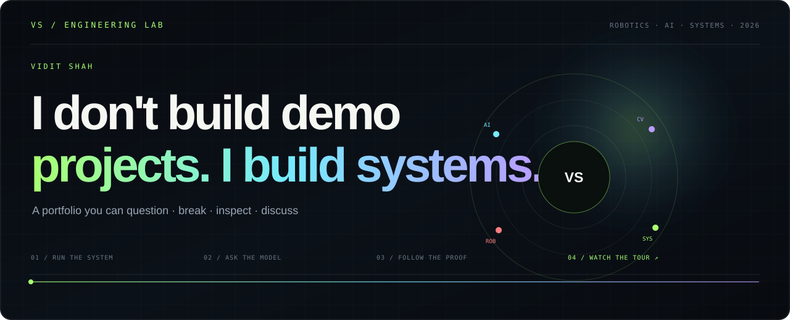
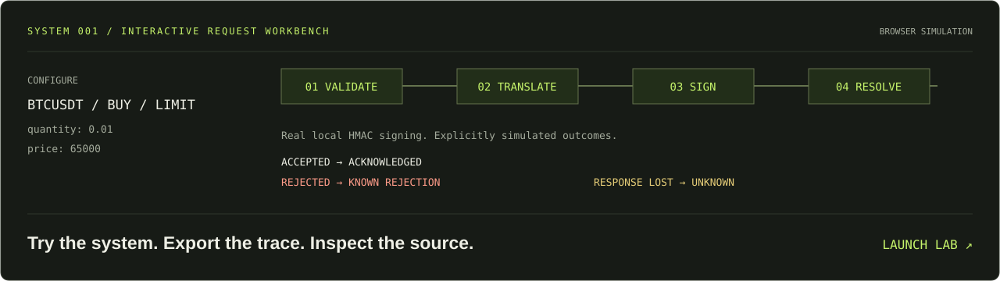
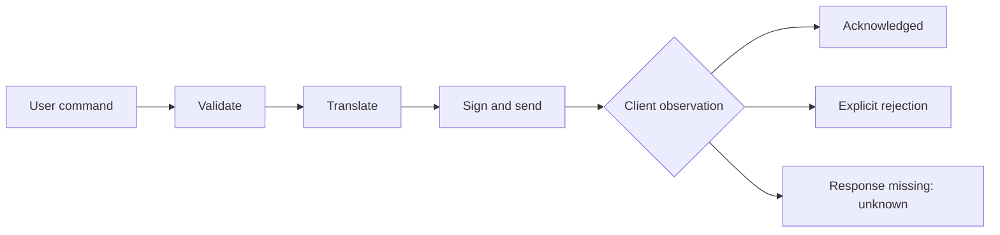

<p align="center"><a href="https://rockstar5656.github.io/rockstar5656/"></a></p>

<p align="center">
<a href="https://rockstar5656.github.io/rockstar5656/"><b>LAUNCH THE LAB ↗</b></a> &nbsp; / &nbsp;
<a href="#system-001--request-engineering">SYSTEMS</a> &nbsp; / &nbsp;
<a href="notebook/README.md">DECISIONS</a> &nbsp; / &nbsp;
<a href="#public-engineering-index">PUBLIC INDEX</a>
</p>

# Vidit Shah

**Python systems · API integration · Automation**

I build software with explicit boundaries and inspectable behavior. My public work explores the engineering between a user's intent and a remote system: validation, protocol translation, request signing, and failure handling.

This profile is an entry point into the source, decisions, and experiments behind that work. Start by running the lab.

## 01 / Try the system

[](https://rockstar5656.github.io/rockstar5656/)

**An interactive browser workbench.** Configure an order, inspect a real local HMAC-SHA256 signature, and choose an accepted response, rejection, or lost response. Export the complete trace as JSON.

- **Break the input.** Watch validation stop the pipeline before signing.
- **Inspect the boundary.** See `STOP_LIMIT` translate into `STOP`.
- **Lose the response.** Explore why a timeout leaves the remote outcome unknown.
- **Follow the evidence.** Open the exact public source revision behind each component.

[**Run an experiment →**](https://rockstar5656.github.io/rockstar5656/) · [Lab source](lab/) · [Verification suite](tests/lab.test.mjs) · [Simulation contract](lab/README.md)

<sub>The lab is an educational JavaScript adaptation. Server outcomes are simulated; it connects to no account and places no orders. Browser processing durations measure this demo only.</sub>

## System 001 / Request engineering

### Binance Futures Testnet CLI

A layered Python command-line application for market, limit, and stop-limit requests. The interesting engineering problem is preserving meaning as an input crosses validation, exchange parameters, signed transport, and an uncertain network.



**What to inspect**

- [Validation](https://github.com/rockstar5656/binance-futures-trading-bot/blob/d7656c42b14aaec7326cc19d8f3d5fa2280389f1/bot/validators.py): normalized requests, decimal values, and cross-field rules.
- [Order adapter](https://github.com/rockstar5656/binance-futures-trading-bot/blob/d7656c42b14aaec7326cc19d8f3d5fa2280389f1/bot/orders.py): protocol translation and structured rejection results.
- [REST client](https://github.com/rockstar5656/binance-futures-trading-bot/blob/d7656c42b14aaec7326cc19d8f3d5fa2280389f1/bot/client.py): HMAC signing, timeouts, and transport exceptions.
- [Tests](https://github.com/rockstar5656/binance-futures-trading-bot/tree/d7656c42b14aaec7326cc19d8f3d5fa2280389f1/tests): inspect which guarantees are established without the network.

[Explore the project →](https://github.com/rockstar5656/binance-futures-trading-bot) · [Technical case study](systems/request-engineering.md)

## 02 / Decisions worth discussing

**A timeout doesn't establish rejection.** The remote service may have accepted a write before the response disappeared. Preserving uncertainty gives the caller a reason to reconcile before retrying.

[Read the analysis →](notebook/001-network-uncertainty.md)

**Translate user concepts at the protocol boundary.** The CLI's `STOP_LIMIT` name becomes the exchange's `STOP` parameter in one inspectable mapping.

[Read the analysis →](notebook/002-protocol-boundaries.md)

**A demo needs a verification contract.** This lab checks a published HMAC test vector, decimal precision, invalid inputs, request translation, and three simulated outcome states.

[Inspect the lab's test suite →](tests/lab.test.mjs) · [Map claims to evidence →](systems/evidence.md)

<details>
<summary><b>03 / Reproduce the browser lab's core checks</b></summary>

Requires Node.js 22 or later. No dependency installation or credentials are needed.

```bash
git clone https://github.com/rockstar5656/rockstar5656.git
cd rockstar5656
node --test tests/lab.test.mjs
```

To run the interface locally with Python installed:

```bash
python -m http.server 8765 --bind 127.0.0.1 --directory lab
```

Open `http://127.0.0.1:8765`. Web Crypto requires a secure context such as localhost or HTTPS.

</details>

<details>
<summary><b>04 / Inspect and verify the Python project</b></summary>

```bash
git clone https://github.com/rockstar5656/binance-futures-trading-bot.git
cd binance-futures-trading-bot
python -m venv .venv
# Windows: .venv\Scripts\activate
# macOS/Linux: source .venv/bin/activate
python -m pip install -r requirements.txt pytest
python -m pytest tests/ -v
```

These are the project's documented offline test commands. They do not place orders. Review the source and limitations before running integration commands.

</details>

## Public engineering index

<!-- PUBLIC-INDEX:START -->
**Public snapshot · 2026-09-15 11:55 UTC**

1 original public project repositories · 0 public forks

- [binance-futures-trading-bot](https://github.com/rockstar5656/binance-futures-trading-bot) — Python CLI trading bot for Binance USDT-M Futures Testnet featuring Market, Limit & Stop-Limit orders, structured logging, validation, exception handling, and modular architecture. (Public; last repository update 2026-07-17).

**Language inventory by GitHub-reported source bytes:** Python: 51,352 bytes.

Source: public GitHub repository metadata and language endpoints. Repository update timestamps may reflect metadata changes; they are not contribution counts.
<!-- PUBLIC-INDEX:END -->

<sub>Updated weekly from public GitHub metadata. Source bytes describe repository inventory; they are not a measure of expertise. Private repositories are excluded.</sub>

---

**Source → architecture → decisions → verification.**

[Interactive lab](https://rockstar5656.github.io/rockstar5656/) · [Engineering notebook](notebook/README.md) · [Public repositories](https://github.com/rockstar5656?tab=repositories) · [Profile source](https://github.com/rockstar5656/rockstar5656)
