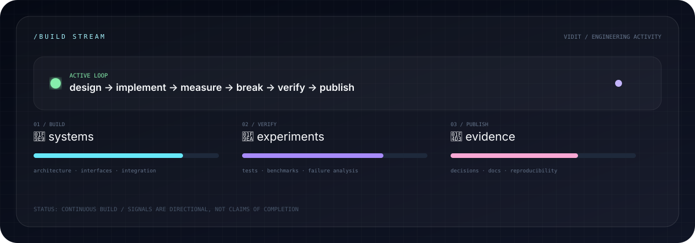

<p align="center">
  
</p>

<p align="center">
  <a href="https://viditshah5656.github.io/"><b>🌐 OPEN THE LAB</b></a>
  &nbsp;·&nbsp;
  <a href="https://github.com/viditshah5656?tab=repositories"><b>🧬 SOURCE</b></a>
  &nbsp;·&nbsp;
  <a href="https://orcid.org/0009-0009-0658-6157"><b>🔬 ORCID</b></a>
</p>

# VIDIT SHAH

### Robotics & AI Engineer · Intelligent Systems · Automation · Software

> **I don't build isolated demos. I design systems — from perception and reasoning to planning, control, automation, and the interfaces that make complex technology usable.**

I work across **robotics, artificial intelligence, computer vision, machine learning, local AI, intelligent agents, automation, control, API systems, and software engineering**. I care about the complete path between an idea and a working system: architecture, data flow, constraints, failure modes, verification, performance, and the decisions underneath the code.

<br />

## 🧭 ENGINEERING PROFILE

<table>
<tr>
<td width="50%">

### 🤖 ROBOTICS

Autonomous systems · robot perception · planning · control · sensors · automation · simulation

</td>
<td width="50%">

### 🧠 AI / ML

Machine learning · local language models · intelligent agents · model integration · inference systems

</td>
</tr>
<tr>
<td>

### 👁️ PERCEPTION

Computer vision · image understanding · detection pipelines · machine vision · visual decision systems

</td>
<td>

### ⚙️ SYSTEMS

Python · software architecture · APIs · automation · interfaces · reliability · verification

</td>
</tr>
</table>

---

## 📡 BUILD TELEMETRY

<p align="center">
  
  
  
  
</p>

<p align="center">
  
  
</p>

<p align="center">
  
</p>

<p align="center">
  
</p>

---

## 🎛️ THE ENGINEERING COMMAND CENTER

This profile is designed as a **command center**, not a résumé page.

```text
┌──────────────────────────────────────────────────────────────────────┐
│                         VIDIT / SYSTEM MAP                           │
├──────────────────────────────────────────────────────────────────────┤
│                                                                      │
│  👁 PERCEIVE ───────► 🧠 REASON ───────► 🗺 PLAN                   │
│       │                    │                    │                    │
│       ▼                    ▼                    ▼                    │
│   vision / data       AI / models         algorithms               │
│                                                                      │
│                         │                                            │
│                         ▼                                            │
│                    ⚙️ CONTROL / ACT                                  │
│                         │                                            │
│                         ▼                                            │
│                  📊 OBSERVE / VERIFY                                 │
│                         │                                            │
│                         └──────────────► 🔁 ITERATE                  │
│                                                                      │
└──────────────────────────────────────────────────────────────────────┘
```

The recurring design question behind my work is:

> **How do we turn uncertain inputs into reliable actions?**

That question appears differently in a robot, a vision pipeline, an AI assistant, an automation system, or a distributed API workflow — but the engineering discipline remains the same.

---

## 🎞️ VISUAL BUILD STREAM

The banner above is an **autoplaying SVG presentation** rather than a static cover image. It cycles through five engineering themes:

`SYSTEM MINDSET` → `LOCAL AI` → `ROBOTICS LOOP` → `COMPUTER VISION` → `ENGINEERING EVIDENCE`

The activity console below it also animates the engineering loop:

`BUILD` → `VERIFY` → `PUBLISH`

These visuals are intentionally generated as vectors so the repository stays lightweight. They can later be replaced with real screenshots, simulator frames, robot footage, architecture diagrams, and benchmark captures.

---

## 🧠 WHAT I ACTUALLY EXPLORE

<table>
<tr>
<td><b>🤖 Robotics</b><br/><sub>Perception, planning, control, automation, simulation</sub></td>
<td><b>👁️ Computer Vision</b><br/><sub>Machine vision, detection, image pipelines, visual decisions</sub></td>
<td><b>🧠 AI / ML</b><br/><sub>Models, inference, intelligent agents, local AI</sub></td>
</tr>
<tr>
<td><b>⚙️ Automation</b><br/><sub>Industrial workflows, software automation, control-oriented systems</sub></td>
<td><b>💻 Software</b><br/><sub>Python, APIs, architecture, tooling, interfaces</sub></td>
<td><b>🔬 Engineering Research</b><br/><sub>Experiments, benchmarking, failure analysis, reproducibility</sub></td>
</tr>
</table>

---

## 🚀 SELECTED SYSTEMS

### 🧩 MeeraAI — Local AI System

A direction centered on making local AI practical through application-level orchestration, model handling, hardware-aware inference, user interfaces, and a workflow that hides unnecessary infrastructure complexity.

**Themes:** `LOCAL AI` · `LLM INFERENCE` · `DESKTOP SYSTEMS` · `HARDWARE AWARENESS` · `UX`

### 👁️ Computer Vision & Machine Intelligence

I am interested in the full vision chain rather than treating vision as a single model call:

```text
CAMERA / DATA
     ↓
PREPROCESSING
     ↓
PERCEPTION
     ↓
FEATURES / OBJECTS
     ↓
REASONING
     ↓
DECISION
     ↓
ACTION / FEEDBACK
```

### ⚙️ Request Engineering / Reliable Software Systems

My public systems work explores a different side of engineering: preserving intent as data crosses validation, translation, signed transport, and unreliable networks.

The key lesson is deliberately simple:

> **A timeout is an observation, not proof of remote state.**

This thinking informs how I design boundaries, failure handling, testing, and system contracts.

---

## 🔬 ENGINEERING LAB NOTEBOOK

I like to leave behind the reasoning, not only the finished artifact.

| Layer | Question |
|---|---|
| 🧱 Architecture | Where should responsibilities live? |
| 🔄 Data flow | How does meaning change as it crosses boundaries? |
| 🧪 Experiment | What exactly are we testing? |
| 📈 Measurement | What did we actually measure? |
| 💥 Failure | What breaks, and why? |
| ✅ Verification | Which claims are backed by evidence? |
| 🔁 Iteration | What changes in the next version? |

The goal is to make projects **inspectable, reproducible, and discussable**.

---

## 🛰️ CURRENT BUILD DIRECTION

```text
LOCAL AI                ████████████████████░  exploring
ROBOTICS                ██████████████████░░░  building
COMPUTER VISION         █████████████████░░░░  expanding
AUTOMATION              ████████████████░░░░░  applying
SYSTEMS ENGINEERING     ███████████████████░░  deepening
RESEARCH / EXPERIMENTS  ███████████████░░░░░░  documenting
```

These bars are **directional**, not numerical claims about completion.

---

## 🧪 HOW I APPROACH A NEW SYSTEM

```text
01  DEFINE THE REAL PROBLEM
        ↓
02  MODEL THE SYSTEM
        ↓
03  EXPOSE THE CONSTRAINTS
        ↓
04  BUILD THE SMALLEST TESTABLE LOOP
        ↓
05  MEASURE IT
        ↓
06  BREAK IT ON PURPOSE
        ↓
07  VERIFY THE FAILURE BOUNDARIES
        ↓
08  SHIP THE NEXT ITERATION
```

That is why I care about **tests, traces, benchmarks, decision logs, observability and readable architecture** as much as the final UI.

---

## 🧬 EVIDENCE GRAPH

The ideal path through my public work is:

<p align="center"><b>IDEA → ARCHITECTURE → IMPLEMENTATION → EXPERIMENT → MEASUREMENT → VERIFICATION → REPRODUCTION</b></p>

Every future flagship project should make that path clickable.

---

## 🛠️ TOOLBOX

<p align="center">
  
</p>

<p align="center"><sub>Tooling evolves with the problem. I prefer understanding systems over collecting logos.</sub></p>

---

## 📚 LEARN / BUILD / VERIFY

**Learn** from papers, documentation, experiments, and first principles.  
**Build** something that exposes a real constraint.  
**Verify** it with tests, benchmarks, traces, or reproducible evidence.  
**Publish** the decisions so another engineer can understand the path.

---

## 🌐 ELSEWHERE

<p align="center">
  <a href="https://viditshah5656.github.io/">🌐 Portfolio</a>
  ·
  <a href="https://www.linkedin.com/">💼 LinkedIn</a>
  ·
  <a href="https://orcid.org/0009-0009-0658-6157">🔬 ORCID</a>
</p>

---

<p align="center">
  
</p>

<p align="center"><b>Build things worth inspecting.</b></p>

<sub>Profile design is intentionally evidence-oriented. Dynamic cards and third-party widgets depend on their respective services. Public projects should be treated as the source of truth for technical claims.</sub>
